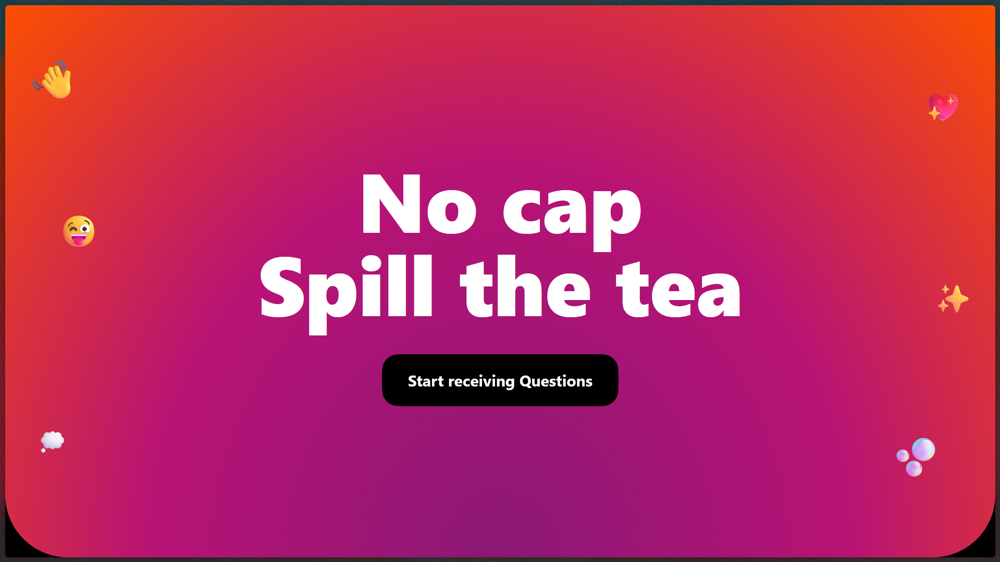

<div align="center">

# 🕵️‍♂️ No cap

App similar to ngl.link — share your link to get honest, anonymous questions and feedback.



**Try it here** 👉 [thenocap.vercel.app](https://thenocap.vercel.app)

</div>

## ✨ Features

- **Anonymous Q&A**: Anyone can send you questions or feedback—no account needed
- **Unique Profile Links**: Share your link anywhere to start receiving messages
- **Real-Time Inbox**: Read and manage messages instantly
- **Profile Controls**: Toggle message reception, check username availability
- **Modern UI**: Built with Next.js, Tailwind, Shadcn-UI, and Squircle.js
- **Supabase DB, Auth & Storage**: Secure, scalable backend

## 🧰 Tech Stack

- Next.js 15
- React 19
- TypeScript
- Tailwind CSS
- Supabase
- Shadcn UI
- Tanstack Query
- Zod
- Motion

## 💻 Getting Started

1. Clone the repository
2. Install dependencies:
   ```bash
   pnpm install
   ```
3. Set up your `.env` with Supabase keys:
   ```
   NEXT_PUBLIC_SUPABASE_URL=your_supabase_url
   NEXT_PUBLIC_SUPABASE_ANON_KEY=your_supabase_anon_key
   ```
4. Run the dev server:
   ```bash
   pnpm dev
   ```
5. Open [http://localhost:3000](http://localhost:3000)

## 🛠️ Development

- Next.js App Router
- Supabase for backend
- TypeScript, ESLint, Prettier
- Tailwind CSS for styling

## 📜 License

MIT

## 💙 Acknowledgements

- [Supabase](https://supabase.com/)
- [Squircle.js](https://squircle.js.org/)
- [Shadcn-UI](https://ui.shadcn.com)
- [Tanstack Query](https://tanstack.com/query/latest)

<div align="center">

<strong>⭐ Leave a star maybe? ⭐</strong>

<a href="https://github.com/buneeIsSlo/nocap">Source</a>
| <a href="https://twitter.com/awwbhi2" target="_blank">Twitter</a>
| <a href="https://github.com/buneeIsSlo" target="_blank">GitHub</a>

</div>
